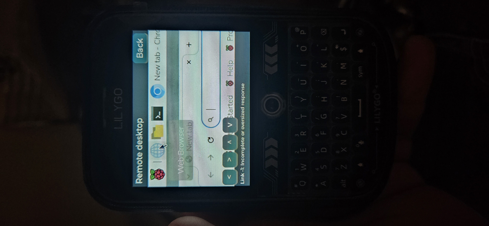

# Real hardware demos

The following desktop recordings show an actual T-Deck Plus connected to a Raspberry Pi. Video audio and metadata were removed. The desktop photo has ancillary metadata removed. Identifying AI-chat and terminal recordings are intentionally excluded from this public repository.

- [Desktop menu interaction](media/20260908_163349.mp4)
- [Remote browser and panning](media/20260908_163445.mp4)

These are full-length resized video copies. Intermittent response errors remain visible and are tracked in [known issues](KNOWN-ISSUES.md); the demo is not a claim of error-free operation.
